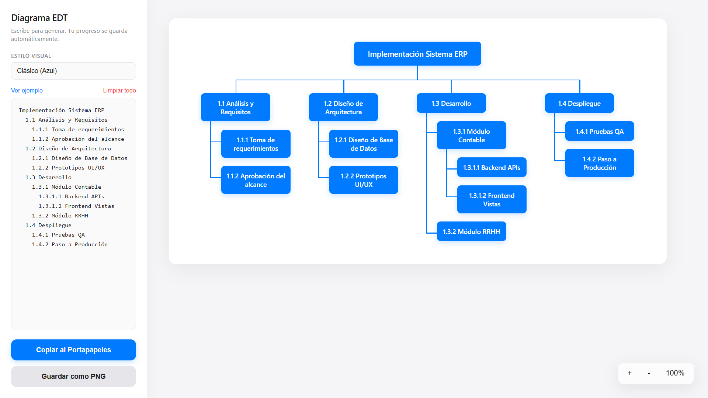

# 📋 Generador EDT

> Web application for visually creating Work Breakdown Structure (WBS) diagrams quickly and exporting them as PNG images.

🌐 **[Live Demo](https://aldairf12.github.io/Generador-EDT/)**

---

## 📌 Overview

**Generador EDT** is a lightweight web application that allows users to create project Work Breakdown Structures (WBS) directly from the browser.

The application focuses on providing a simple visual interface for organizing project tasks and hierarchy.

---

## ✨ Features

- 📋 Create WBS structures
- 🌳 Organize project hierarchy
- ✏️ Edit project elements
- 🖱️ Interactive visual interface
- 🖼️ Export diagrams as PNG
- 🚫 No registration required
- ⚡ Lightweight browser-based application

---

## 🎥 Demo

👉 **[Try the application](https://aldairf12.github.io/Generador-EDT/)**

---

## 📸 Preview



---

## 🛠️ Technologies

- HTML5
- CSS3
- JavaScript

---

## 🏗️ How it works

```text
Create Project
      ↓
Add Main Activities
      ↓
Create Subtasks
      ↓
Organize Hierarchy
      ↓
Generate WBS
      ↓
Export as PNG
